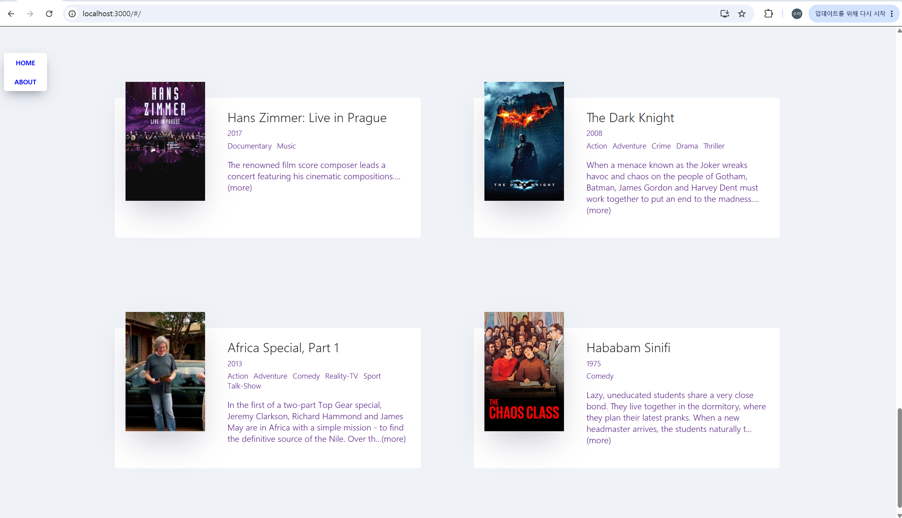

## Table of contents

- [Overview](#overview)
  - [Screenshot](#screenshot)
  - [Links](#links)
- [My process](#my-process)
  - [Built with](#built-with)
  - [What I learned](#what-i-learned)
  - [Continued development](#continued-development)
  - [Useful resources](#useful-resources)
  - [AI Collaboration](#ai-collaboration)
- [Author](#author)

## Overview

### Screenshot

### Links

- Live Site URL: [Add live site URL here](https://SuaJeong-winter.github.io/movie-app-clone-study)

## My process

### Built with

- [React](https://reactjs.org/) - JS library
- [노마드 코더](https://nomadcoders.co/react-for-beginners) - 책 참조

### What I learned

- 리액트의 생명주기 함수
- 리액트의 props, state 관리
- react-router-dom v5와 v6의 차이점 비교
- 버전차이로 발생할 수 있는 상황에 대한 코드 리팩토링

### Continued development

- 스타일링
- 사용자 데이터 등록 기능

### Useful resources

- [React docs](https://ko.legacy.reactjs.org/docs/getting-started.html) - 리액트의 생명주기 함수를 포함하여 필요한 메서드, 및 기억 안나는 개념 참고

### AI Collaboration

- chatGPT와 github copilot을 사용해서 개발 진행했습니다.
- debugging, brainstorming solutions, questioning을 목적으로 사용했습니다

## Author

- Website - [정수아Jeong Sua](https://github.com/SuaJeong-winter)
